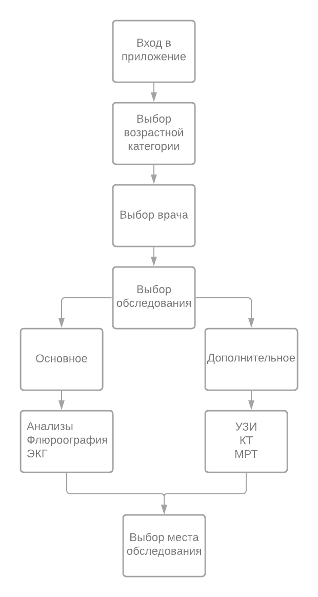
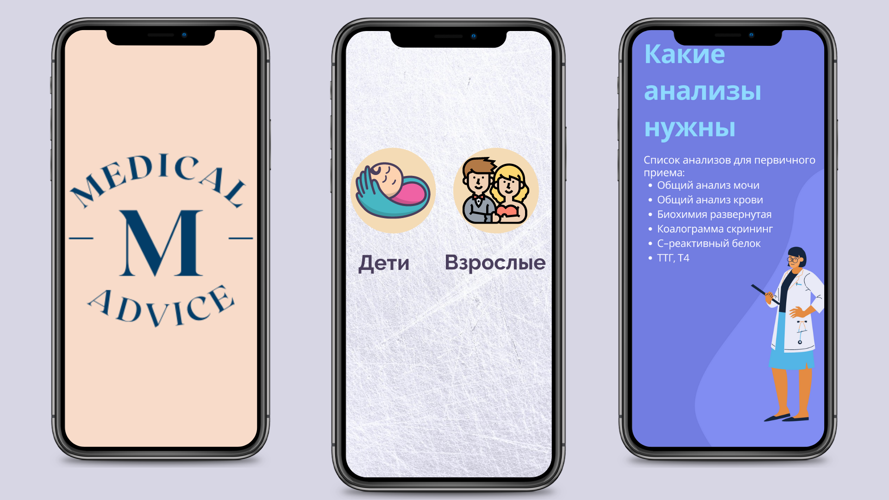
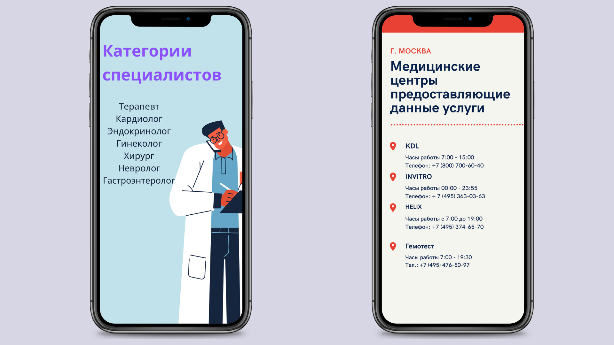

Выбранный мною проект, будет связан с медициной. 

Данное приложение будет направлено на помощь людям, которые только собираются на первичный прием,
но не знают, что для этого нужно сделать. 

Помощь будет заключаться в следующем:
1. Список необъходимых обследований для первичного приема, по категориям врачей;
2. Места, в которых пациент может сделать на выгодных условиях обследование.

Что будет лежать в основе?

Обследования:
1. Основные
2. Дополнительные 

Все обследования будут подразделяться на различные категории. И для удобства использования данного
приложения, категории будут разделяться на возрастные рамки. А также на категории специалистов.

Виды услуг:

Так как в основном я буду использовать две категории обследований, они будут включать в себя
следующие услуги:

Основные:
1. Анализы
2. Фдюорография
3. ЭКГ

Дополнительные:
1. УЗИ
2. КТ
3. МРТ

Когда пользователь выберет нужное обследование, и категории, ему выйдет список, либо перевень
позиций с нужными анализами, или же другой услугой.

Следующее, места, где можно сделать данную услугу:

Тут скорее всего будут либо сами локации, либо названия организаций, в которых выгоднее всего
можно пройти обследование.

Ниже представлена схема работы.

На фотографиях 1 и 2, показан примерный план реализации.

